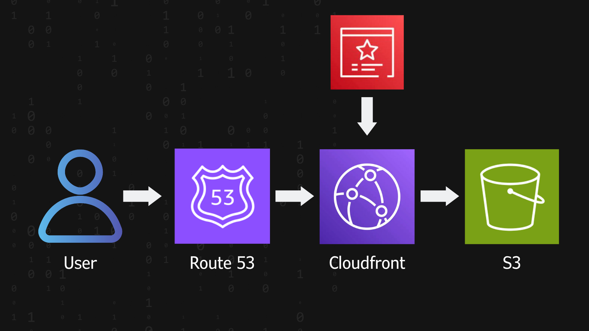

# 🌐 Project 1 — Static Website Hosting on AWS with S3, CloudFront, ACM, and Route 53

This project demonstrates a fully deployed, secure, and production-ready static website architecture on AWS.  
It follows industry best practices for availability, performance, and cloud security.

Technologies used:

- **Amazon S3** — Static hosting  
- **Amazon CloudFront** — Global CDN  
- **AWS Certificate Manager (ACM)** — SSL/TLS certificates  
- **Amazon Route 53** — DNS & domain management  
- **IAM + OAC** — Secure access control  
- **Versioning** — Content protection

---

## 🎯 Project Objective

Deploy a scalable, secure, and cost-effective static website using fully managed AWS services.

This project showcases skills in:

- Cloud architecture  
- AWS security  
- DNS & SSL certificate management  
- Serverless design  
- Documentation and best-practice implementation  

---

## 📌 High-Level Architecture (Including Route 53 & ACM)

---

## 🛠 AWS Services Overview

| Service | Purpose |
|---------|---------|
| **Amazon S3** | Static file hosting. Bucket remains private using OAC. |
| **CloudFront** | Global CDN delivering low-latency content over HTTPS. |
| **AWS Certificate Manager (ACM)** | Provisioning and managing SSL certificates. DNS validation. |
| **Route 53** | DNS management, domain routing, Alias records to CloudFront. |
| **IAM** | Secure access control via OAC and policies. |
| **S3 Versioning** | Protects against accidental deletions/overwrites. |

---

## 📂 Repository Structure

cloud-portafolio/
- project-1/
  - README.md
  - diagram.png
  - index.html

---

## 🚀 Deployment Steps

### 1. Create the S3 bucket
- Unique bucket name (can match your domain).
- Disable public access (mandatory).
- Enable versioning.
- Upload `index.html`.
- 
- 
- 

---

### 2. Request SSL certificate with ACM
- **Region: us-east-1 (N. Virginia)** — CloudFront requires this.
- Add domains:
  - `yourdomain.com`
  - `www.yourdomain.com`
- Choose **DNS validation**.
- 

---

### 3. Validate the certificate in Route 53
- ACM provides DNS CNAME records.
- Route 53 can auto-create them.
- Status will change to **Issued** when ready.

---

### 4. Configure Origin Access Control (OAC)
OAC ensures S3 bucket remains private while CloudFront can read it.

- Create OAC
- Attach OAC to CloudFront origin
- CloudFront updates bucket policy automatically
- 
- 

---

### 5. Create the CloudFront distribution
Recommended configuration:

- Origin: S3 bucket with OAC
- Viewer protocol: **Redirect HTTP to HTTPS**
- Custom certificate: Select ACM certificate
- Default root object: `index.html`
- Enable compression
- Leave caching defaults or configure later
- 
- 

---

### 6. Configure domain using Route 53
In your Hosted Zone:

- **A (Alias)** → CloudFront distribution  
  - 

---

### 7. Test the deployment
Verify:

- HTTPS is working  
- CloudFront is serving content  
- DNS resolves correctly  
- Certificate is valid  
- S3 bucket is not publicly accessible
- 

---

## 🌎 Live URL

https://cookieprueba.link/

---

## 🧠 Skills Demonstrated

✔ AWS Architecture  
✔ Cloud Security Best Practices  
✔ SSL/TLS Certificate Management (ACM)  
✔ DNS & Domain Management (Route 53)  
✔ CDN Optimization (CloudFront)  
✔ Serverless Web Hosting  
✔ Professional Cloud Documentation  

---

## 🔐 Recommended Security Enhancements

To further strengthen this architecture and align with AWS security best practices, the following enhancements are recommended:

### **1. AWS WAF (Web Application Firewall)**
Attach AWS WAF to the CloudFront distribution to protect against:
- SQL Injection  
- Cross-Site Scripting (XSS)  
- OWASP Top 10 attacks  
- Malicious bots  

---

### **2. SSE-KMS Encryption with Customer-Managed Keys (CMKs)**
Enable **SSE-KMS** encryption on the S3 bucket to:
- Enforce key rotation  
- Restrict access using key policies  
- Audit encryption/decryption events via CloudTrail  

---

### **3. CloudFront Origin Shield**
Use **Origin Shield** to:
- Add an extra caching layer  
- Protect your S3 origin from high-load bursts  
- Improve cache hit ratio  

---

### **4. IAM Least-Privilege Access**
Ensure all IAM policies follow the least-privilege principle:
- Limit permissions to only required actions  
- Avoid broad permissions like `s3:*`  
- Prefer IAM roles over long-term access keys  

---

### **5. Block All Public Access to S3**
Even though the site is public, the S3 bucket must not be public.  
All access should go through CloudFront.

Benefits:
- Enforces WAF  
- Prevents bypassing CloudFront  
- Reduces attack surface  

---

### **6. CloudFront Geo-Restrictions**
Optionally block traffic from unwanted geographic regions to reduce exposure to global threats.

---

### **7. Monitoring & Logging (CloudTrail + CloudWatch)**
Enable:
- **CloudTrail** for auditing API activity  
- **CloudWatch Alarms** for unauthorized access attempts  
- **WAF logs** for blocked or suspicious requests  

---

### **8. AWS Config Security Rules**
Use AWS Config to detect misconfigurations such as:
- Public S3 buckets  
- Missing encryption  
- Overly permissive IAM policies  
- Misconfigured CloudFront distributions  

---

### **9. CloudFront Access Logging**
Store CloudFront logs in a secure S3 bucket for:
- Traffic analysis  
- Incident response  
- Security forensics  

---

### **10. Route 53 DNSSEC**
Enable **DNSSEC** in Route 53 to protect your domain from DNS spoofing and tampering.

---

## 📬 Contact

- LinkedIn: https://www.linkedin.com/in/victor-matos-188769242?utm_source=share_via&utm_content=profile&utm_medium=member_ios 
- GitHub: Victor Matos
